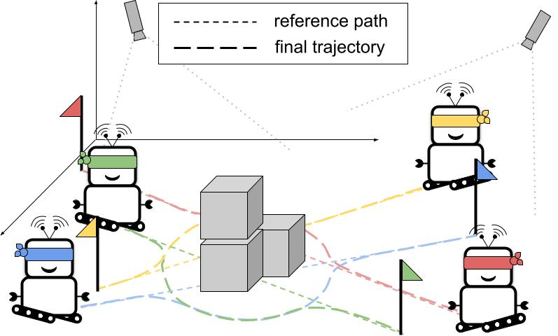

# Bird's-Eye-View Based Trajectory Planning of Multiple Mobil Robots Using DRL and MPC
*Trajectory Planning of Multiple Robots using Vision-Based Continuous Deep Reinforcement Learning and Model Predictive Control*


The main branch of this repository is the single robot implementation of our paper. The multiple robot implementation is in a separate branch in the repository.

The paper can be found here: [Paper](doc/iros24_official.pdf)
## Quick Start
### OpEn
The NMPC formulation is solved using open source implementation of PANOC, namely [OpEn](https://alphaville.github.io/optimization-engine/). Follow the [installation instructions](https://alphaville.github.io/optimization-engine/docs/installation) before proceeding. 

### Install dependencies (after installing OpEn)
```
pip install -r requirements.txt
```
or
```
conda env create -f environment.yaml
```
**NOTE** If you cannot create the virtual environment via conda, please create your own virtual environment (e.g. conda create -n rlboost python=3.9), and pip install.
Make sure your RUST is up-to-date and Pytorch is compatible with Cuda. 

### Generate MPC solver
Go to "test_block_mpc.py", change **INIT_BUILD** to true and run
```
python test_block_mpc.py
```
After this, a new directory *mpc_build* will appear and contain the solver. Then, you are good to go :)

### To train the DDPG
Go to "src/continous_training_local.py", change **load_checkpoint** to False and run.

## Use Case
Run *src/main_continous.py* for the simulation in Python. Several cases are available by changing ```scene_option``` in *src/main_continous.py*.

## Extended result table
| Scene    | Obstacle Type                    | Method      | Comp. time (mean) | Comp. time (max) | Comp. time (std) | Deviation (mean) | Deviation (max) | Speed | Angular speed | Finish time step | Success rate (%) |
|:--------:|:--------------------------------:|:-----------:|:-----------------:|:----------------:|:-----------------:|:----------------:|:---------------:|:------:|:-------------:|:----------------:|:----------------:|
| Scene 1  | (a) Rectangular obstacle         | MPC         | 29.03             | 94.11            | 24.51             | 0.54             | 1.94            | 0.04   | 0.03          | 76               | 100              |
| Scene 1  | (a) Rectangular obstacle         | DDPG        | 0.77              | 10.41            | 7.78              | 1.02             | 1.98            | 0.08   | 0.61          | 73               | 100              |
| Scene 1  | (a) Rectangular obstacle         | HYB-DQN-V   | 23.07             | 240.46           | 45.22             | 0.91             | 2.11            | 0.03   | 0.1           | 81               | 100              |
| Scene 1  | (a) Rectangular obstacle         | HYB-DDPG    | 11.94             | 49.74            | 8.54              | 0.9              | 2.23            | 0.02   | 0.06          | 76               | 100              |
| Scene 1  | (b) Two obstacles                | HYB-DQN-V   | 20.18             | 109.7            | 18.39             | 1.0              | 2.68            | 0.04   | 0.06          | 98               | 100              |
| Scene 1  | (b) Two obstacles                | HYB-DDPG    | 17.38             | 86.21            | 14.31             | 0.96             | 2.62            | 0.03   | 0.05          | 97               | 100              |
| Scene 1  | (c) U-shape obstacle             | DDPG        | 0.79              | 10.65            | 7.85              | 0.98             | 1.91            | 0.08   | 0.58          | 74               | 100              |
| Scene 1  | (c) U-shape obstacle             | HYB-DQN-V   | 93.49             | 1019.9           | 254.09            | 0.84             | 2.93            | 0.09   | 0.16          | 118              | 40               |
| Scene 1  | (c) U-shape obstacle             | HYB-DDPG    | 15.74             | 99.04            | 17.95             | 0.87             | 2.18            | 0.02   | 0.07          | 75               | 100              |
| Scene 1  | (d) Dynamic obstacle (face-to-face) | MPC     | 16.07             | 129.18           | 25.02             | 0.44             | 1.69            | 0.03   | 0.04          | 69               | 100              |
| Scene 1  | (d) Dynamic obstacle (face-to-face) | DDPG    | 0.82              | 10.96            | 7.95              | 0.74             | 1.94            | 0.08   | 0.48          | 77               | 98               |
| Scene 1  | (d) Dynamic obstacle (face-to-face) | HYB-DDPG | 11.13             | 69.7             | 13.01             | 0.9              | 2.85            | 0.02   | 0.05          | 79               | 100              |
| Scene 2  | (e) Sharp turn with an obstacle  | DQN-V       | 0.69              | 10.74            | 5.49              | 0.87             | 1.44            | 0.19   | 0.7           | 150              | 78               |
| Scene 2  | (e) Sharp turn with an obstacle  | DDPG        | 0.74              | 10.61            | 5.35              | 0.53             | 1.37            | 0.09   | 0.56          | 158              | 96               |
| Scene 2  | (e) Sharp turn with an obstacle  | HYB-DQN-V   | 11.8              | 135.32           | 15.95             | 0.49             | 1.8             | 0.02   | 0.04          | 149              | 100              |
| Scene 2  | (e) Sharp turn with an obstacle  | HYB-DDPG    | 14.82             | 98.26            | 15.47             | 0.43             | 1.63            | 0.01   | 0.03          | 151              | 100              |
| Scene 2  | (f) U-turn with an obstacle      | DQN-V       | 0.75              | 10.48            | 7.80              | 0.42             | 0.87            | 0.17   | 0.67          | 149              | 40               |
| Scene 2  | (f) U-turn with an obstacle      | DDPG        | 0.73              | 10.48            | 5.00              | 0.63             | 1.05            | 0.13   | 0.51          | 169              | 74               |
| Scene 2  | (f) U-turn with an obstacle      | HYB-DQN-V   | 14.19             | 99.66            | 15.10             | 0.43             | 1.67            | 0.02   | 0.03          | 148              | 100              |
| Scene 2  | (f) U-turn with an obstacle      | HYB-DDPG    | 11.91             | 75.17            | 11.80             | 0.4              | 1.42            | 0.02   | 0.02          | 147              | 100              |

## Evaluation videos
Videos of the evaluations are available on [youtube](https://www.youtube.com/watch?v=A2TAuWXqH2k&list=PLPOBQOuy0QPRkYZ1olWVMvoB_gpyaQp5T)


## 


