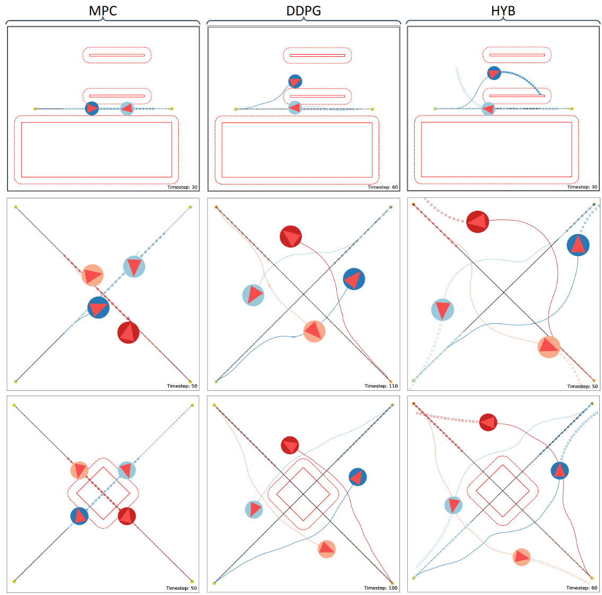

# DDPG-Boosted MPC for Collision-Free Navigation of Multiple Mobile Robots (Multi-Robot Branch)
*Collision-Free Trajectory Planning of Mobile Robots by Integrating
Deep Reinforcement Learning and Model Predictive Control*



## Quick Start
Please set up OpEn (Rust-based) and install the dependencies before running the code. For details, go to the main branch of the repository.

### Generate MPC solver
Go to "test_block_mpc.py", change **INIT_BUILD** to true and run
```
python test_block_mpc.py
```
After this, a new directory *mpc_solver* will appear and contain the solver. Then, you are good to go :)

### To train the DRL agent
For the training of the DRL agent, since we use distributed training, it is the same as the single-robot (main) branch. Please refer to the main branch for the training.

## Use Case
Run *main_continous_multi.py* for the simulation in Python. Several cases are available in the entrance of the file.

The complete quantitative results (of Fig. 3 in the paper) is:
| Scenario | Method | Final step (mean) | Final step (std) | Final step (max) | Sucess rate (%) |
|:--------:|:------:|:-----------------:|:----------------:|:----------------:|:---------------:|
| 3        | MPC    |  138.33           |  39.46           |  183             | 90              |
| 3        | DDPG   |  118.40           |  3.34            |  126             | 100             |
| 3        | HYB    |  51.7             |  0.95            |  53              | 100             |
|          |        |                   |                  |                  |                 |
| 4        | MPC    |  125.10           |  15.03           |  146             | 100             |
| 4        | DDPG   |  146.10           |  17.98           |  178             | 100             |
| 4        | HYB    |  60.00            |  2.05            |  63              | 100             |
|          |        |                   |                  |                  |                 |
| 5        | MPC    |  -                |  -               |  -               | 0               |
| 5        | DDPG   |  142.60           |  1.71            |  145             | 100             |
| 5        | HYB    |  79.20            |  5.98            |  94              | 100             |
  

## License
Go to the main branch for the license.


